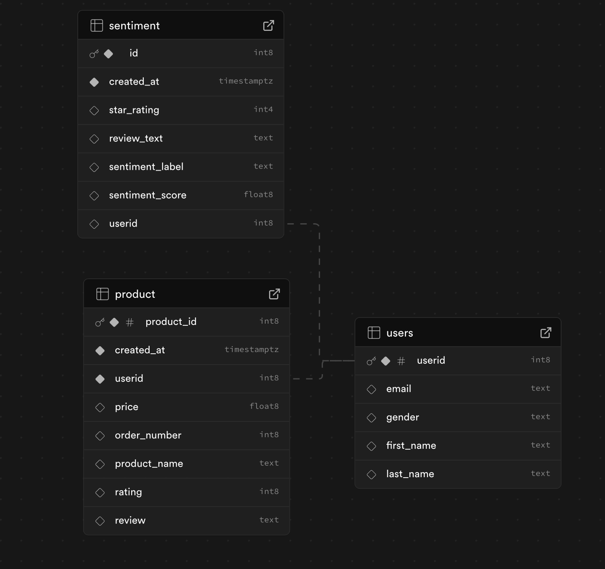
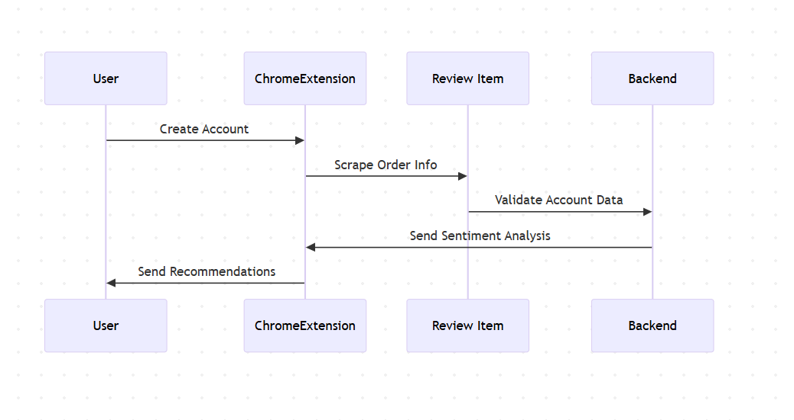

# Assigment 2
1) 

Here once the user installs the Chrome Extension, they will be redirected to our Vercel Hosted webpage where they will be prompted to login/register. Once successful, after validation with the Supabase backend, they will be able to scrape order history in Amazon for example and then review the products via Chrome Extension. This information will be in the Supabase Database as well but will also be sent to the Sentiment Analysis Model to give some sentiments of user styles and products. After that, we will use an LLM engine to give recommendations in the Chrome Extension popup.

2) 
This is the ER Diagram for project and after the first release we prposed a different idea for our data pipline so if that goes well, our ER Diagram will look similar to this. We have our users table with their relavent information and the table that will be used for the product. This is for the items a user previously ordered which will be sent to the model. Then we have the sentiment table which the user sent with ratings of their orders as well as the sentiment anlaysis from the model and all of that will be put in a single table.

3) 

It starts with the user creating an account and then the Chrome Extension will scrape order information from Amazon as an example. Then review items will happen where user will give review from 1-5 starts with other data and then we will validate this data. Once successful, our backend will send a sentiment analysis which will be used to send recommendations. This is what is needed for the Chrome Extension feature.

