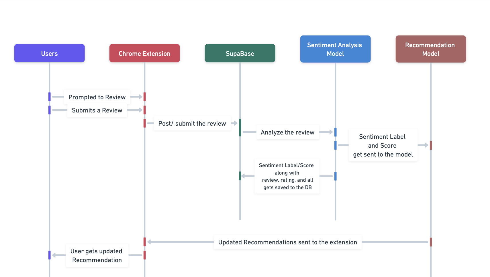

# Fit Check Archetecture

Fit Check is built around two main components: a website (hosted on Vercel) and a Chrome extension, both connected to a Supabase backend.
Users sign up on the website and complete a style survey. That data is stored in Supabase and used by the Chrome extension (only available if the user is logged in) to:

- Evaluate if a product fits their preferences,
- Prompt for reviews after purchases,
- Pass reviews into a Sentiment Analysis Model, which feeds into an LLM Engine connected to a product/shop database for smart recommendations.

All user data and review history are stored in Supabase, keeping everything in sync and personalized.

### Entity Diagram – User Review & Sentiment Feature

This diagram models the relationship between users, the products they review, and the sentiments analyzed from those reviews. Each product review is tied to a user and contains a star rating and text. That text is sent to a sentiment model, and the resulting label and score are stored in the sentiment table along with the original review and a reference to the user. This structure allows for tracking user preferences and improving future recommendations.

### Call Sequence Diagram – Submitting a Review via Chrome Extension

This call sequence diagram outlines the process triggered when a user is prompted by the Chrome Extension to leave a product review. The user submits a 1–5 star rating and a paragraph of feedback through the extension. This data is sent to Supabase, which handles both the backend logic and database storage. Supabase sends the review text to an external Sentiment Analysis Model, which returns a sentiment label and score. Supabase then stores the original review, rating, and sentiment result in the database. Once stored, the updated review data is used to notify or refresh the Recommendation Model, which updates the user's personalized suggestions accordingly.