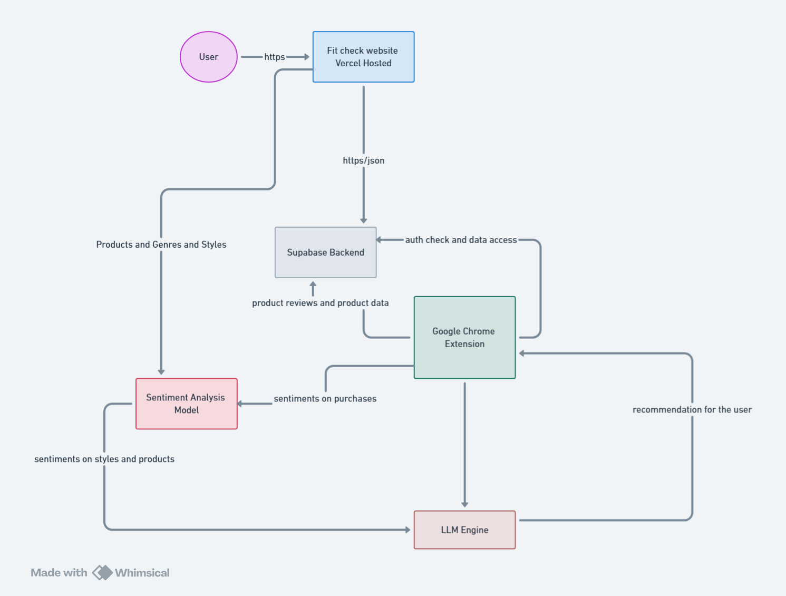
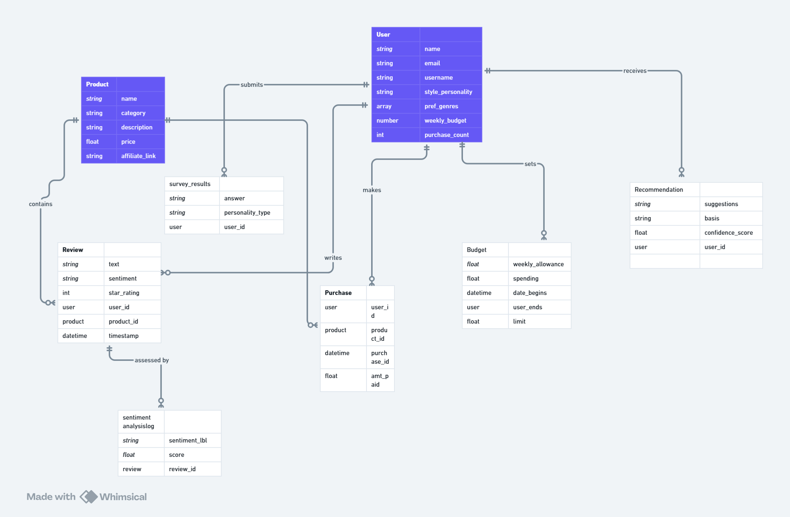

## FitCheck Architecture

This document outlines the system architecture for the FitCheck Chrome Extension.

## Description
The system architecture of FitCheck involves a user interacting through a React-based Chrome Extension and a hosted website (via Vercel). User data is sent through HTTPS to a Supabase backend, which handles authentication, data storage, and retrieval. The extension collects purchase data and browsing behaviors, which are used to generate product recommendations through a built-in Sentiment Analysis Model and LLM engine. These services analyze feedback and style preferences to provide smarter, more personalized suggestions in real-time.

## Entity Relationship Diagram

The diagram outlines the core entities in FitCheck and how they interact. Users have style profiles, set budgets, and submit survey responses. They make purchases and leave product reviews, which are analyzed for sentiment. Products are linked to purchases and reviews, while recommendations are generated based on user activity and sentiment scores. These connected tables enable personalized, data-driven suggestions within the app.

