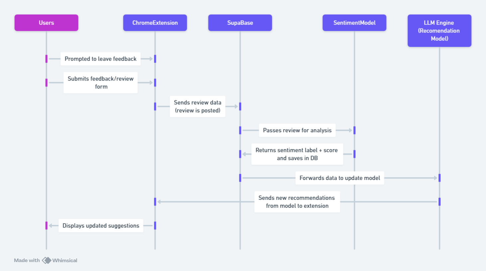

## FitCheck Architecture

This document outlines the system architecture for the FitCheck Chrome Extension.

## Description

The system architecture of FitCheck involves a user interacting through a React-based Chrome Extension and a hosted website (via Vercel). User data—such as style preferences, product interactions, and survey responses—is sent via HTTPS to a Supabase backend, which handles authentication, data storage, and retrieval. The extension also submits product reviews, which are processed in-browser using a built-in Sentiment Analysis Model powered by TensorFlow.js. This model does not rely on external APIs, allowing the Chrome Extension to analyze sentiment locally. The output from this model is passed directly to a lightweight LLM Engine—also running in-browser—which uses the data to generate product recommendations. These recommendations are returned to the extension and displayed to the user in real time. By keeping both the Sentiment Model and LLM Engine client-side, the system ensures low latency and stronger privacy, while Supabase continues to serve as the backbone for persistent data and user state management.

## Entity Relationship Diagram

The diagram outlines the core entities in FitCheck and how they interact. Users have style profiles, set budgets, and submit survey responses. They make purchases and leave product reviews, which are analyzed for sentiment. Products are linked to purchases and reviews, while recommendations are generated based on user activity and sentiment scores. These connected tables enable personalized, data-driven suggestions within the app.

## Sequence Diagram

This sequence diagram illustrates the flow of data when a user submits a product review through the FitCheck Chrome Extension. After being prompted, the user submits feedback, which is sent to the Supabase backend. Supabase then forwards the review to the Sentiment Analysis Model for evaluation. The model returns a sentiment label and score, which are stored in the database and used to update the recommendation logic. This updated data is passed to the LLM Engine, which generates personalized product suggestions. Finally, the Chrome Extension receives the new recommendations and displays them to the user in real time.

